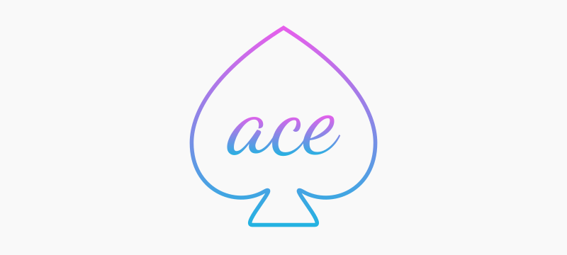

  

  A charming engine. A simple and charming 2D game engine for Javascript.

### What is it?

Ace is designed to be a really small and lighweight engine for 2D games.

- It has no complicated physics;
- It has no fancy tools for making advanced games;
- It's just a wrapper around the HTML Canvas abstraction with a basic game loop; and some more nice stuff :)

That's it. It's perfect for the ones that are making simple games for fun or learning. If your intention is to making advanced and powerful games, there are a lot of better options outside there.

### Development stage

> Ace is in a very initial development stage. It's not ready for production yet.

It's going to be awesome if you become part of this. Contributions are really really welcome! :)
