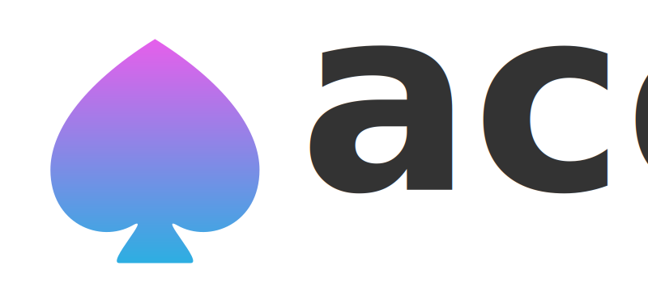

<p align="center">
  <a href="./docs/ace.svg"></a>
</p>

<p align="center">
  <b>A Charming Engine.</b><br/>
  A simple and charming 2D game engine for Javascript.
</p>

### What is it?

Ace is designed to be a really small and lighweight engine for 2D games.

- It has no complicated physics;
- It has no fancy tools for making advanced games;
- It's just a wrapper around the HTML Canvas abstraction with a basic game loop; and some more nice stuff :)

That's it. It's perfect for the ones that are making simple games for fun or learning. If your intention is to making advanced and powerful games, there are a lot of better options outside there.

### Development stage

> Ace is in a very initial development stage. It's not ready for production yet.

**It'll be awesome if you become part of this**. Contributions are really really welcome! Let's have fun! :)

### Installing

_There is no method for installing this library yet. Soon this is going to be posted to npm and also to CDN servers :)_

### Building

After cloning this repo, install the dependencies:

```bash
npm install
```

For building the library, run:

```bash
npm run build
```

_This is going to create a `build` folder with the generated Javascript files for CommonJS, UMD, AMD, ESM, browser and system modules._

For running the examples, you can execute:

```
npm start
```

_This is going to start a local server with hot-reload enabled by default. Then, you can open your browser, access the address indicated in the console and add /example-name for accessing the example-name._

### License

[MIT License](https://opensource.org/licenses/MIT)

